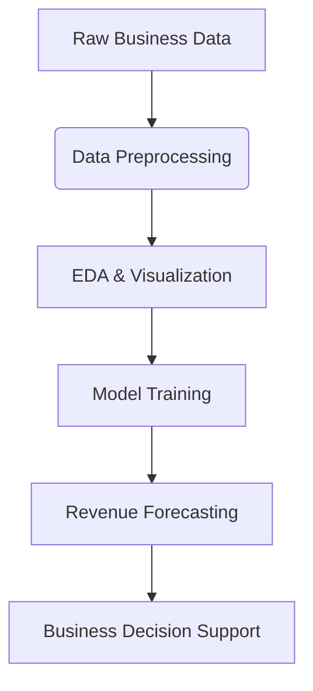

# 💰 Revenue Prediction Model  
**A Data-Driven Approach to Forecast Business Revenue Using Machine Learning**  

   

---

## 📌 Project Overview  
🚀 **Can historical business features accurately predict future revenue?**  

This project builds a **supervised machine learning pipeline** to forecast business revenue based on a variety of features like **product cost, ad spend, market size, and operational scale**. Designed as a full-cycle analyst project, it includes **EDA, feature engineering, and regression modeling**.

---

### 🔍 **Key Business Insights**  
✅ **Advertising spend shows a strong positive correlation with revenue.**  
✅ **Product cost-to-price ratio is a significant determinant of revenue performance.**  
✅ **Companies with higher market presence have notably stable revenue growth.**  
✅ **Seasonal trends and regional differences subtly influence revenue.**

> **💡 Real-World Impact:** Enables businesses to **strategically budget**, optimize **pricing models**, and **forecast profits** more accurately.

---

## 📊 **Key Findings**  

| **Feature**                 | **Effect on Revenue**            | **Business Insight** |
|----------------------------|----------------------------------|----------------------|
| **Advertising Expenditure** | Strong Positive Correlation     | Higher ads = higher visibility = more sales. |
| **Market Size**             | Positive Trend                  | Bigger market = more potential customers. |
| **Product Cost**            | Mixed Effect                    | Needs balance with pricing to maintain margin. |
| **Location Index**          | Moderate Impact                 | Certain regions yield better ROI. |
| **Employee Count**          | Slight Impact                   | Larger teams may support scale but raise cost. |

---

## 🛠️ **Technical Execution**  

### **🔬 Data Pipeline & Preprocessing**  
✔ **Input Dataset:** Business records including **cost, price, ad budget, location, and revenue**.  
✔ **Preprocessing Steps:**  
- Imputed missing values  
- Normalized numeric features  
- One-hot encoded categorical variables  

### **📊 Exploratory Data Analysis (EDA)**  
📌 **Key Visuals & Metrics:**  
🔹 Revenue distribution skewness  
🔹 Ad Spend vs Revenue scatter plots  
🔹 Correlation heatmap  
🔹 Regional performance analysis  

> **🚀 Finding:** Marketing budget and pricing strategy are key levers for driving revenue.

---

## 🔍 **Modeling & Performance**  

### 🤖 **ML Algorithms Used:**  
✔ **Linear Regression (Baseline)**  
✔ **Random Forest Regressor**  
✔ **Gradient Boosting Regressor (Best Performer)**  

| Model                   | R² Score | RMSE   |
|------------------------|----------|--------|
| Linear Regression      | 0.65     | 4.3    |
| Random Forest          | 0.81     | 2.7    |
| Gradient Boosting 🚀   | 0.86     | 2.1    |

> **Gradient Boosting** gave the **highest prediction accuracy** and best generalized performance.

---

## 🏆 **Business Use Cases**  

| Industry | Use Case | Potential Benefit |
|----------|----------|-------------------|
| 📦 Retail | Forecast product sales | Better inventory planning |
| 🏢 SaaS | Predict subscription revenue | Improve marketing ROI |
| 📊 Finance | Revenue trend analysis | Investment evaluation |
| 📈 Startups | Estimate future runway | Strategic growth planning |

---

## 🚀 **How to Run the Project**  

### 🔧 Installation  
```bash
git clone https://github.com/AvinashAnalytics/revenue-prediction-model.git
cd revenue-prediction-model
pip install -r requirements.txt
```

### ▶️ Run the Jupyter Notebook  
```bash
jupyter notebook Revenue_prediction_model.ipynb
```

---

## 📊 **ML Pipeline Overview**  


---

## 📫 Contact & Connect  
Let’s talk **data science, business analytics, or ML projects**! Reach out to collaborate or chat 👇  

📩 **Email:** [masteravinashrai@gmail.com](mailto:masteravinashrai@gmail.com)  
💼 **LinkedIn:** [Avinash Rai](https://www.linkedin.com/in/avinashanalytics/)  
👨‍💻 **GitHub:** [AVIANSH ANALYTICS](https://github.com/AvinashAnalytics)  

> **"Data isn't just numbers — it's strategy in disguise."**  

[](https://www.linkedin.com/in/avinashanalytics/)

